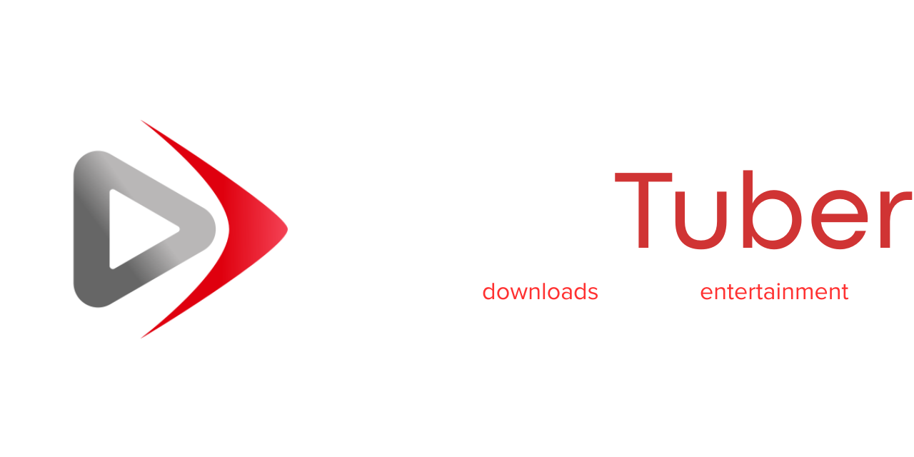

<div align="center">
    
🇧🇷 [Português](README.md) • 🇺🇸 [English](README_EN.md) • 🇪🇸 Español




[](https://github.com/EasyTuber/EasyTuber/releases/latest "Installation")
[](https://github.com/EasyTuber/EasyTuber/commits "Commit History")
[](https://github.com/EasyTuber/EasyTuber/pulse/monthly "Last activity")
[](https://www.python.org/downloads/)
[](LICENSE)

</div>

**EasyTuber** es una aplicación intuitiva que te permite descargar videos y audio de YouTube con facilidad. Con una interfaz simple y eficiente, puedes guardar tu contenido favorito en solo unos clics, sin complicaciones.

## 🚀 Características  
- 🎨 **Interfaz amigable e intuitiva**  
- 🎵 **Soporte para múltiples formatos de video y audio**  
- ⚡ **Descargas rápidas y eficientes con yt-dlp**  
- 🎯 **Elige la calidad y el formato antes de descargar**  
- 🎬 **Soporte para listas de reproducción**
- 📁 **Organización automática de descargas**
- 🆓 **¡Código abierto y gratuito!**

## 🛠️ Herramientas Utilizadas
- **yt-dlp**: Para descargas de video
- **FFmpeg**: Para conversión y procesamiento de medios
- **Python**: Lenguaje base del proyecto
- **CustomTKinter**: Para la interfaz gráfica
- [**CTkThemesPack**](https://github.com/a13xe/CTkThemesPack): Usando el tema 'red'
- [**ctk_components**](https://github.com/rudymohammadbali/ctk_components): Usando `CTkProgressPopup` y `CTkNotification`
- [**CTkMessagebox**](https://github.com/Akascape/CTkMessagebox): Para pop-ups
- [**CTkToolTip**](https://github.com/Akascape/CTkToolTip): Para tooltips

## 📥 Descarga e Instalación  
### 🔹 **Prerrequisitos**
1. Instala [FFmpeg](https://ffmpeg.org/download.html) en tu sistema
   - Windows: Descarga la versión esencial del sitio web oficial o usa `choco install ffmpeg`
   - Linux: `sudo apt install ffmpeg` (Ubuntu/Debian)
   - macOS: `brew install ffmpeg` (usando Homebrew)

### 🔹 **Descargar Ejecutable**  
1. Visita la [página de releases](https://github.com/EasyTuber/EasyTuber/releases).  
2. Descarga la última versión de **EasyTuber**.   
3. **Ejecuta EasyTuber** y ¡disfruta!
4. ⏳ **¡Espera un momento!** El programa puede tardar unos momentos en abrir.

### 🔹 **Ejecutar desde el Código Fuente** _(Opcional)_  
Si prefieres ejecutar desde el código fuente:  
```bash
git clone https://github.com/your-username/EasyTuber.git
cd EasyTuber
pip install -r requirements.txt
python easytuber.py
```

## 🎮 Cómo Usar  
1️⃣ **Abre el programa**  
2️⃣ **Pega el enlace del video que quieres descargar**  
3️⃣ **Elige la calidad y formato deseado**  
4️⃣ **Haz clic en "Descargar" y espera a que ocurra la magia!** ✨  

## 🐛 Solución de Problemas
Si encuentras algún problema:
1. Verifica si FFmpeg está instalado correctamente
2. Asegúrate de tener una conexión estable a internet
3. Intenta ejecutar el programa como administrador
4. Verifica que tu antivirus no esté bloqueando el programa

## 🤝 Contribuir
¿Quieres ayudar a mejorar EasyTuber? ¡Todas las contribuciones son bienvenidas!
Si quieres contribuir:
1. Haz un **Fork** del proyecto
2. Crea una rama:
```bash
git checkout -b mi-nueva-caracteristica
```
3. Realiza tus cambios y haz commit:
```bash
git commit -m "Agregué una nueva característica"
```
4. Envía para revisión:
```bash
git push origin mi-nueva-caracteristica
```
5. Abre un **Pull Request**

## 📜 Licencia  
Este proyecto está licenciado bajo la [GNU General Public License v3.0 (GPLv3)](LICENSE).

---
<div align="center">
    <sub>Desarrollado con ❤️ por la comunidad EasyTuber</sub>
</div> 